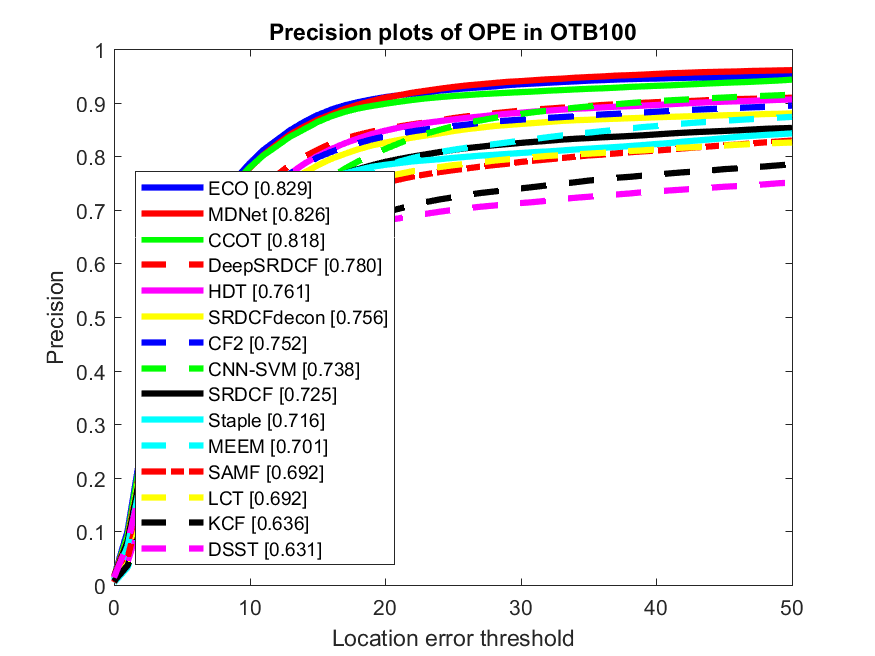
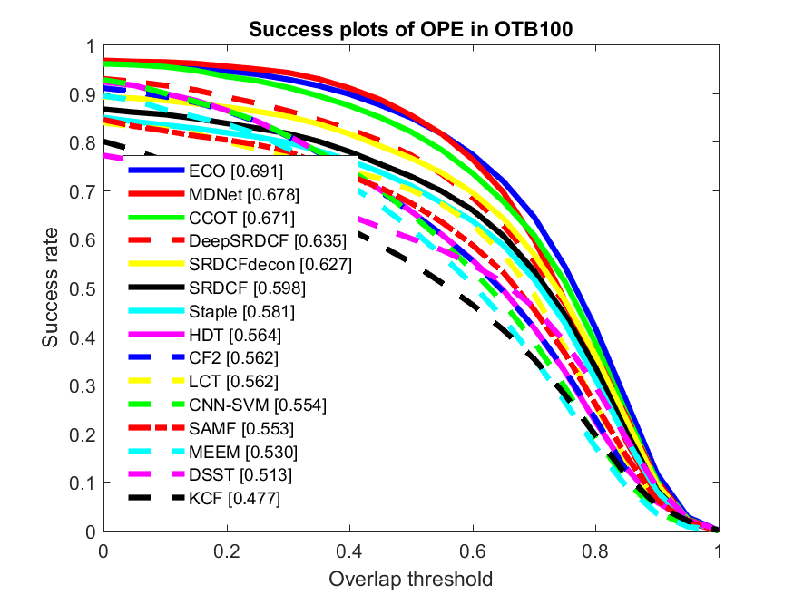
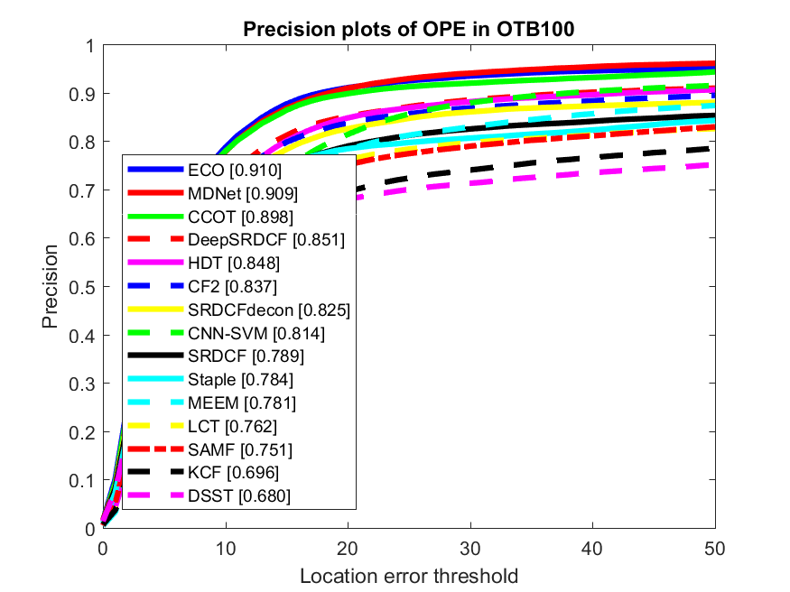
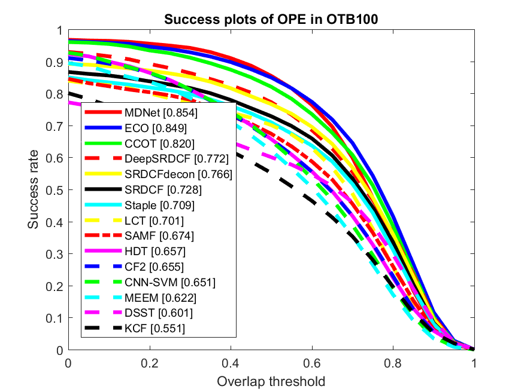

Unified Tracking Benchmark Toolkit
===

## Acknowledgment

This is a fork from [Yizhuang Zhou repository](https://github.com/ZhouYzzz/otb-toolkit) with the idea to improve it and maintain it with more up-to-date results. Also extend it to other datasets.

Anyone interested in collab is more than welcome :)

## About

This is a friendly toolkit for comparing your Tracker/s and the State-of-the-art trackers on datasets like the Online Tracking Benchmark (OTB-2013 and OTB-2015) or Temple-Color-128
The source code was inherited from the official repository [Visual Tracking Benchmark](http://cvlab.hanyang.ac.kr/tracker_benchmark/index.html).

You can obtain results for a specific dataset like OTB100.
Trackers are ranked according to the AUC (Area Under the Curve) of the plots...

... or by a specific Threshold (0.5 for Success plot and 20 pixel distance for Precision plot)

## Features
* Compatible tracking protocol
* Selection of different benchmarks to evaluate with (OTB, Temple-Color-128)
* Auto download and configure sequences (or customizable path if dataset is already downloaded)
* Highly designable and Modularized code, based on original OTB Benchmark
* Updated with state-of-the-art results

## Usage

1. Add your tracker repository to `trackers` folder by creating a folder with your tracker name and putting the code there.
2. Configure your tracker for evaluation modifying the file `configs/config_trackers.m`. See examples included in the file.
3. Define which trackers to use for evaluation result comparison modifying the file `configs/config_trackers.m`.
4. Configure evaluation method and dataset to used by modifying `run_evaluation.m` file.
5. Execute `run_evaluation.m` script to evaluate on the desired dataset.

## To-do List (in no particular order)
* Add configuration for evaluating in Temple-Color-128 dataset
* Results per challenging attributes
* Add more up-to-date results (if you want to help with this, please contact me!, any help is more than welcome!)
* Possibility of writing a script to execute tracker code that is not included in the `trackers` folder (maybe?)

## Citation

If you use this toolkit, please consider citing the corresponding authors of the benchmarks:

UNDER CONSTRUCTION
