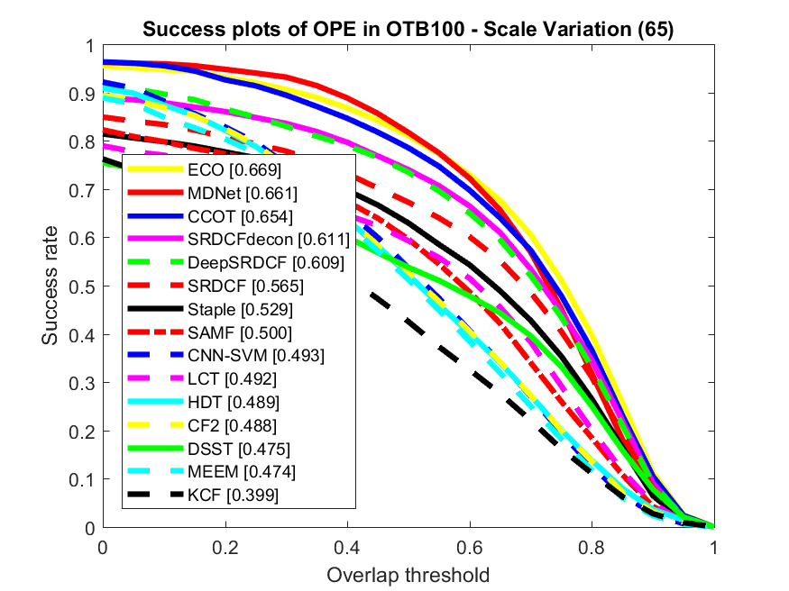
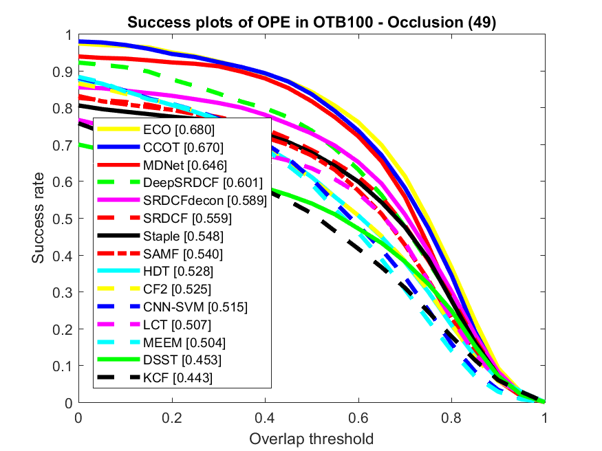

Unified Tracking Benchmark Toolkit
===

## Acknowledgment

This is a fork from [Yizhuang Zhou repository](https://github.com/ZhouYzzz/otb-toolkit) with the idea to improve it and maintain it with more up-to-date results. Also extend it to other datasets.

Anyone interested in collab is more than welcome :)

## About

This is a friendly toolkit for comparing your Tracker/s and the State-of-the-art trackers on datasets like the Online Tracking Benchmark (OTB-2013 and OTB-2015) or Temple-Color-128
The source code was inherited from the official repository [Visual Tracking Benchmark](http://cvlab.hanyang.ac.kr/tracker_benchmark/index.html).

You can obtain results for a specific dataset like OTB100.
Trackers are ranked according to the AUC (Area Under the Curve) for the Success plot...
<p align="center">

</p>

... or by a specific Threshold: 0.5 for Success plot, 20 pixel mean distance for Precision plot
<p align="center">


</p>

The tool would also output the per challenge results if the ranking type is set to AUC
<p align="center">


</p>

## Features
* Compatible tracking protocol
* Selection of different benchmarks to evaluate with (OTB, Temple-Color-128)
* Automatic download and configuration of sequences (with customizable path if dataset is already downloaded)
* Highly modularized code, based on original OTB Benchmark
* Updated with state-of-the-art results

## Usage

1. Add your tracker repository to `trackers` folder by creating a folder with your tracker name and putting the code there.
2. Configure your tracker for evaluation modifying the file `configs/config_trackers.m`. See examples included in the file.
3. Define which trackers to use for evaluation/result comparison modifying the file `configs/config_trackers.m`.
4. Configure evaluation method and dataset to used by modifying `run_evaluation.m` file, variables `dataset` and `rankingType`.
5. Execute `run_evaluation.m` script to evaluate on the desired dataset.

## To-do List (in no particular order)
* Add more up-to-date results (if you want to help with this, please contact me!, any help is more than welcome!)
* Possibility of writing a script to execute tracker code that is not included in the `trackers` folder (maybe?)

## Citation

If you use this toolkit, please consider citing the corresponding authors of the benchmarks:

↓ [OTB Citations] ↓
```
@InProceedings{Wu2013,
  author    = {Y. Wu and J. Lim and M. Yang},
  title     = {Online Object Tracking: A Benchmark},
  booktitle = {Proc. IEEE Conf. Computer Vision and Pattern Recognition},
  year      = {2013},
  pages     = {2411--2418},
  month     = jun,
  doi       = {10.1109/CVPR.2013.312},
  issn      = {1063-6919},
  keywords  = {computer vision, image sequences, object tracking, performance evaluation, computer vision, online object tracking, image sequences, performance evaluation, robust tracking, performance analysis, Target tracking, Robustness, Algorithm design and analysis, Object tracking, Performance evaluation, Visualization},
}
```
```
@Article{Wu2015,
  author   = {Y. Wu and J. Lim and M. Yang},
  title    = {Object Tracking Benchmark},
  journal  = {IEEE Transactions on Pattern Analysis and Machine Intelligence},
  year     = {2015},
  volume   = {37},
  number   = {9},
  pages    = {1834--1848},
  month    = sep,
  issn     = {0162-8828},
  doi      = {10.1109/TPAMI.2014.2388226},
  keywords = {Target tracking, Object tracking, Algorithm design and analysis, Performance evaluation, Robustness, Histograms, Object tracking, benchmark dataset, performance evaluation, Object tracking, benchmark dataset, performance evaluation},
}
```

↓ [Temple Color Citations] ↓
```
@Article{7277070, 
author={P. Liang and E. Blasch and H. Ling}, 
journal={IEEE Transactions on Image Processing}, 
title={Encoding Color Information for Visual Tracking: Algorithms and Benchmark}, 
year={2015}, 
volume={24}, 
number={12}, 
pages={5630-5644}, 
keywords={computer vision;image coding;image colour analysis;image sequences;inference mechanisms;object tracking;computer vision;visual tracking;discriminative clues;visual inference;color integration;chromatic models;color sequences;factor annotations;RGBD tracking benchmark;color-encoded trackers;color model;Image color analysis;Visualization;Target tracking;Benchmark testing;Color;Image coding;Gray-scale;Visual tracking;color;benchmark;evaluation;Visual tracking;color;benchmark;evaluation}, 
doi={10.1109/TIP.2015.2482905}, 
ISSN={1057-7149}, 
month={Dec},}
```
